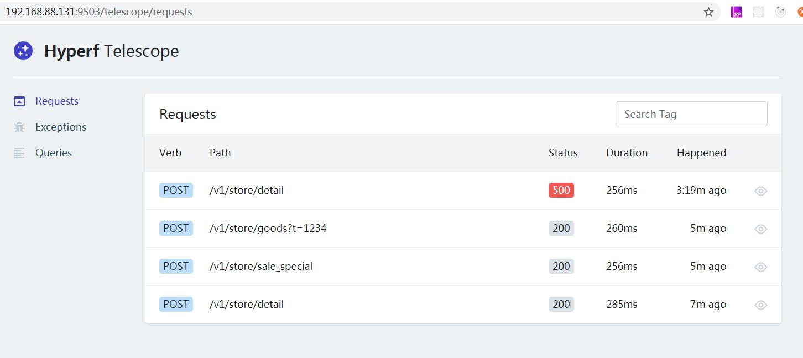

### Get Started

参考laravel telescope的代码开发出来的适用了hyperf的调试工具

`composer require windawake/hyperf-telescope`

## 一键安装telescope
`php ./bin/hyperf.php telescope:install`

## 如果一键安装有问题，请尝试下面安装方式：

#### 复制migrations到根目录
`php ./bin/hyperf.php vendor:publish windawake/hyperf-telescope`

#### 运行数据库表迁移
`php ./bin/hyperf.php migrate`

### 启动项目
`php ./bin/hyperf.php start`

### 访问地址
`http://127.0.0.1:9501/telescope/requests`

### 功能点
- [x] 开箱即用
- [x] 记录request请求
- [x] 记录异常错误
- [x] 记录sql语句
- [ ] 记录tcp请求

### 提供配置项
```
# 修改.env
TELESCOPE_ENABLED=false #默认开启
TELESCOPE_TIMEZONE=Asia/Shanghai #默认php时区
TELESCOPE_QUERY_SLOW=50 #单位毫秒
```

## 效果图

